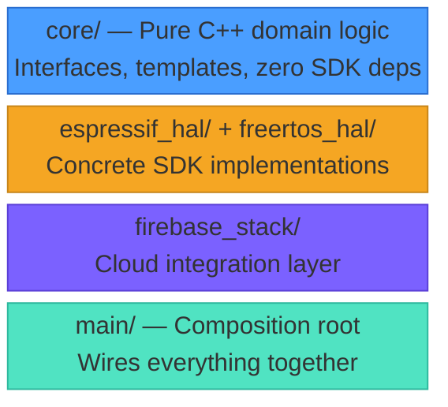
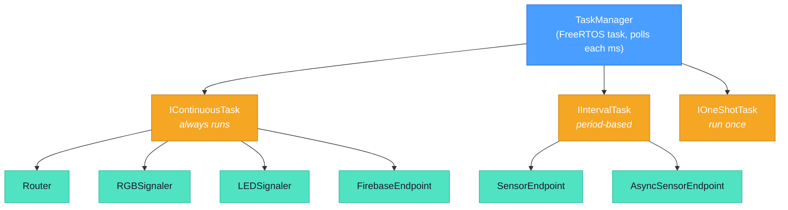
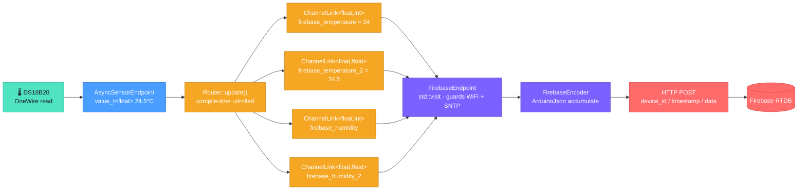

# Ficus Sensor

ESP32 plant monitoring firmware — embedded C++ with layered architecture.

Personal project measuring my beloved ficus' health parameters.

## Reason d'etre

This is the project I work on when either:
- I want to learn new concepts
- I am fed up with the issues on my job's codebase and decide to try doing it my way

---

## Project Structure

```
ficus_sensor/
├── core/                   Pure C++ domain logic (no SDK imports)
│   ├── fic_hal/            Abstract hardware interfaces
│   ├── threading/          Task hierarchy & TaskManager scheduler
│   ├── channel_linking/    Typed data channels, conversions & router
│   ├── sensors/            Sensor abstractions + DS18B20, analog humidity
│   ├── sensor_adapters/    Bridge sensors → channel system
│   ├── signalling/         LED/RGB pattern engine (SignalerBase template)
│   ├── fic_time/           Time abstraction (TimeSource, TimeDelay)
│   ├── fic_log/            Logging with pluggable backend
│   ├── pooling/            ObjectPool<T,N> — static pre-allocated storage
│   ├── time/               Lightweight Timer struct
│   ├── tls/                ICredentialsProvider interface
│   └── versioning/         Compile-time Version struct (M.m.p.t format)
│
├── espressif_hal/          ESP-IDF concrete implementations
│   ├── adc/                ADC oneshot + calibration
│   ├── esp_fic_log/        Log backend → esp_log
│   ├── esp_fic_time/       Time → xTaskGetTickCount / vTaskDelay
│   ├── http_client/        HTTP client (plain + TLS), job queue worker
│   ├── leds/               WS2812 LED strip via RMT
│   ├── onewire/            OneWire bus via RMT
│   ├── reset/              Reset reason utilities
│   ├── sntp/               SNTP time sync client
│   └── wifi/               WiFi controller, station, AP, scanner + shared context
│
├── freertos_hal/           FreeRTOS-specific implementations
│   ├── queue/              FreeRTOSQueue<T,N> (static, ISR-safe)
│   └── task/               FreeRTOS_TaskRunner (pinned core tasks)
│
├── firebase_stack/         Firebase RTDB integration
│   ├── firebase_channel.hh   Typed channel wrapper with name/unit metadata
│   ├── firebase_encoder.hh   JSON encoder + HTTP sender (ArduinoJson)
│   ├── firebase_endpoint.*   IContinuousTask: consumes channels → sends to RTDB
│   └── firebase_stack_version.hh
│
└── main/                   Application entry point & composition root
    ├── composition.hh/cpp  All object construction & wiring (single TU)
    └── ficus_sensor_main.cpp  app_main — lean, only uses composition API
```

## Architecture Overview

### Layer Hierarchy

The firmware follows a strict four-layer architecture. Each layer depends only on the ones above it.



The **dependency rule** is strict: `core/` and `stack/` folders never includes SDK headers. All platform access goes through abstract interfaces in `fic_hal/`, with concrete implementations in `espressif_hal/` and `freertos_hal/`.

### HAL Interfaces

All hardware is accessed through pure abstract interfaces defined in `core/fic_hal/`:

| Domain | Interface(s) | ESP Implementation |
|--------|-------------|-------------------|
| ADC | `IADC` | `ADC` |
| LED | `ILEDLifecycle`, `ILightable`, `IColorable` | `LEDStripSingle` |
| OneWire | `IOnewireBus` | `OnewireBus` |
| WiFi | `IWiFiLifecycle`, `IWiFiStatusManager`, `IWiFiStation`, `IWiFiAccessPoint`, `IWiFiScanner` | `WiFiController`, `WiFiStation`, `WiFiAccessPoint`, `WiFiScanner` |
| HTTP | `IHttpClient`, `IHTTPListener` | `HttpClient`, `HttpsClient`, `PlainHttpClient` |
| Queue | `IQueue<T>` | `FreeRTOSQueue<T, N>` |
| Task | `ITaskRunner` | `FreeRTOS_TaskRunner` |
| Time | `TimeSource`, `TimeDelay` | `EspTimeSource`, `EspTimeDelay` |
| TLS | `ICredentialsProvider` | `FakeTLSProvider` (embedded PEM) |
| SNTP | `ISntpClient` | `EspSntpClient` (system time sync) |

### Threading Model

A cooperative task loop runs inside a FreeRTOS task. `TaskManager` polls all registered `ITask` objects once per millisecond.



- **IContinuousTask** — `should_run()` always true. Used by Router, Signalers, FirebaseEndpoint.
- **IIntervalTask** — runs when `(now - last_run) ≥ period`. Used by sensor endpoints.
- **IOneShotTask** — runs until `is_finished()`, optionally resettable.

### Composition Root

All object construction is centralized in `main/composition.cpp`. The main file only includes the thin `composition.hh` header, which exposes the minimal API needed by `app_main`:

- `rgb_signaler` — status LED control
- `sntp_client` — time sync management
- `composition_get_wifi_state()` — WiFi status
- `composition_init_hardware()` / `composition_add_tasks()` / `composition_start_comms()`

Channel consumption is now handled entirely by `FirebaseEndpoint` inside the task loop — `app_main` no longer reads channel values directly.

This keeps `ficus_sensor_main.cpp` lean (~50 lines) and free of concrete hardware knowledge.

---

## Channel Linking

Ficus Sensor's **typed, compile-time data routing system**. It connects producers (sensor endpoints) to consumers (display, cloud upload) through typed channels with optional inline conversion. The entire pipeline resolves at compile time — zero dynamic dispatch, zero allocation.

### Components

**`value_t<T>`** — Channel primitive. Holds a typed value with flags (`VALID`, `NEW`) and a rolling version counter (`uint8_t`). Producers call `update()` to write; consumers call `consume()` to read and clear the NEW flag.

**`ChannelLink<From, To, Converter>`** — Typed pipe between two channels. On `sync()`, compares source version to detect changes, applies the converter, and propagates value + validity to the destination.

**`Router<Links...>`** — Variadic template holding all links in a `std::tuple`. Syncs them via `std::apply` + fold expression. As an `IContinuousTask`, it runs every TaskManager tick.

### Data Flow Example



### Firebase Stack

The Firebase integration adds three components on top of the channel system:

**`firebase_channel<T>`** — Wraps a `value_t<T>` with metadata (`name`, `unit`). Acts as the destination channel for data routed towards the cloud.

**`FirebaseEndpoint`** — An `IContinuousTask` that iterates a list of `firebase_channel` pointers (via `std::variant` + `std::visit`), consumes new values, feeds them to the encoder, and triggers a send when data is ready. Guards on WiFi connectivity and SNTP time sync before transmitting.

**`FirebaseEncoder`** — Accumulates key-value pairs into an ArduinoJson document, then serializes under `{device_id: {unix_timestamp: {data...}}}` and POSTs to Firebase RTDB.

### Converters

All converters are stateless structs with `static apply()` methods, fully inlined by the compiler:

| Category | Examples |
|----------|---------|
| Identity | `NoConv` (default) |
| Temperature | `ToFahrenheit`, `FromFahrenheit` |
| Math | `Addition<5.0f>`, `Multiplication<10.0f>`, `Division<2.0f>` |
| Bitwise | `BitShiftLeft<T, N>`, `BitShiftRight<T, N>`, `BitMask<T, M>` |
| Logical | `EqualTo<T, V>`, `GreaterThan<T, V>`, `LessThan<T, V>` |
| Chains | `MathChain<Steps...>` (float pipeline), `ConverterChain<Steps...>` (native type) |

### Adding a New Channel

```cpp
// 1. Declare sensor output and firebase channel
static value_t<float> light_output;
static firebase_channel<int> firebase_light("light_level", "lux");

// 2. Add to firebase channel list
static FirebaseChannelPtr firebase_channel_list[] = {
    &firebase_temperature,
    &firebase_humidity,
    &firebase_light          // ← new
};

// 3. Add link to router (with conversion)
static Router router{
    ChannelLink<float, int>{t_sensor_output, firebase_temperature.value},
    ChannelLink<float, int>{h_sensor_output, firebase_humidity.value},
    ChannelLink<float, int, MathChain<Division<10.0f>>>{light_output, firebase_light.value}  // ← new
};
```

The `FirebaseEndpoint` automatically picks up the new channel — it iterates the channel list via `std::visit` and encodes any channel with new data.

---

## Design Patterns

| Pattern | Where | Purpose |
|---------|-------|---------|
| Dependency Injection | Sensors, signalers, TaskManager, HttpsClient | HAL deps via constructor references |
| Strategy | Converter templates, `ICredentialsProvider`, `_configure_client()` | Swap algorithms without changing callers |
| Adapter | `SensorEndpoint`, `AsyncSensorEndpoint` | Bridge sensor measurements → channels |
| Template Method | `SignalerBase`, `HttpClient::_configure_client()` | Fixed algorithm skeleton, customizable steps |
| Service Locator | `TimeSource`, `TimeDelay` | Global time access (pragmatic for embedded) |
| Object Pool | `ObjectPool<T,N>` in HttpClient | Pre-allocated, zero-fragmentation job storage |
| Observer | `IHTTPListener` | Async HTTP response/failure notification |
| Visitor | `std::visit` on `FirebaseChannelPtr` | Type-safe iteration of heterogeneous channel list |

## Error Handling

Explicit return-value propagation using `fic_error_t` enum with domain-reserved ranges. Convenience macros with `[[unlikely]]` branch hints:

- `FIC_RETURN_ON_ERROR(expr, log)` — propagate error code
- `FIC_RETURN_VOID_ON_ERROR(expr, log)` — for void functions
- `FIC_RETURN_VALUE_ON_ERROR(expr, val, log)` — return custom value
- `FIC_ERR_RETURN_ON_FALSE(cond, err, log)` — boolean guard

## Versioning

The `Version` struct provides compile-time version representation in `M.m.p.t` format (major, minor, patch, test). Constructed `constexpr` from either four `uint8_t` parts or a packed `uint32_t`:

```cpp
static constexpr Version product_version = Version(0, 0, 1, 0);  // "0.0.1.0"
static constexpr Version from_packed = Version(0x00010200);       // "0.1.2.0"
```

All firmware components carry independent version tags.

## Configuration


## Technical support and feedback


